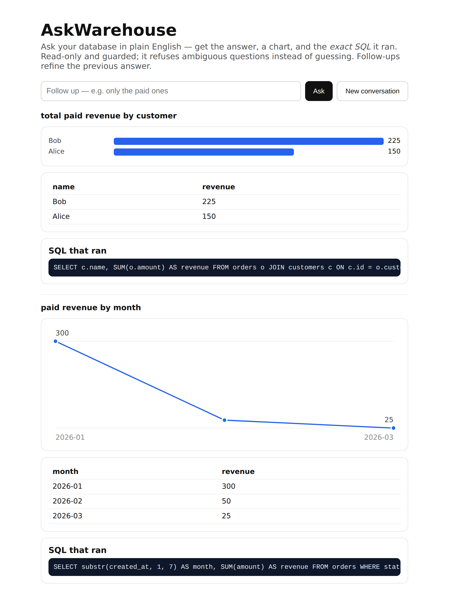
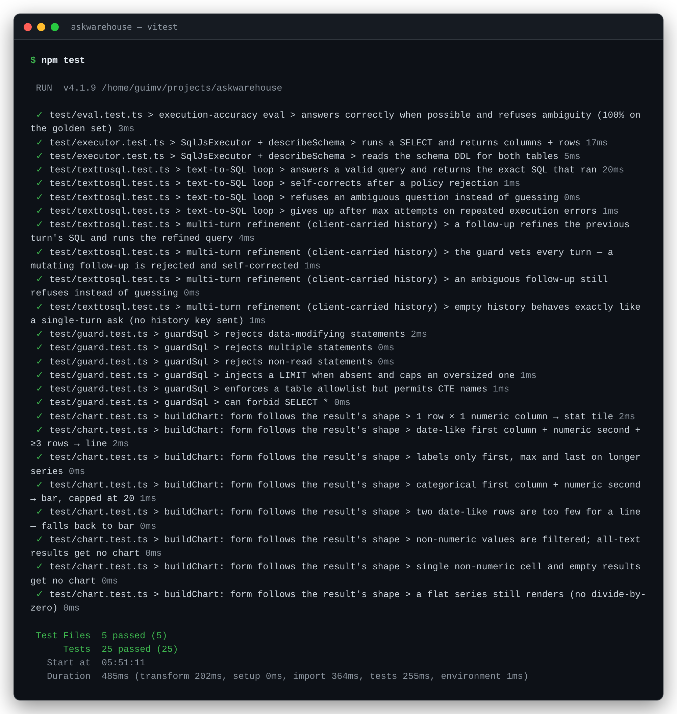

# askwarehouse

**Ask your database in plain English — get the answer, a chart, and the *exact SQL* it ran.** Read-only
and guarded; it refuses ambiguous questions instead of guessing.



A **Cloudflare Worker** (Hono + D1 + Claude) turns a question into a single read-only SQL query behind a
security guard, with a self-correcting loop; an **Angular + RxJS** dashboard (`web/`) shows the answer, a
chart, and the query. The one load-bearing decision — *the guard, not the model, decides what runs* — is in
[`docs/adr/0001-read-only-guard.md`](docs/adr/0001-read-only-guard.md).

## Why

Text-to-SQL that runs generated SQL against a real database is dangerous (writes, drops, runaway scans) and
prone to confidently wrong answers on ambiguous questions. This one is the version a senior engineer would
put in front of a customer's data: read-only by construction, transparent (it always shows the SQL), and
honest (it refuses rather than fabricates).

## How it works

```
question ─► Claude proposes SQL ─► [guard] ─► read-only sandbox (D1) ─► answer + chart + the SQL
                    ▲                  │
                    └── self-correct ──┘   (policy reject / exec error, bounded retries)
                    │
       "AMBIGUOUS: …" ⇒ ask for clarification, never guess
```

The guard enforces: single statement · `SELECT`/`WITH` only · no DDL/DML · an injected/​capped `LIMIT` ·
an optional (CTE-aware) table allowlist.

The backend core is **provider-agnostic** (`src/core`): it depends on `SqlExecutor` / `SqlModel`
interfaces, so the guard, the loop, and an execution-accuracy eval are all tested **offline** against a
real SQLite sandbox (`sql.js`) — no account or API key required. Production swaps in Cloudflare D1 + Claude.

## Status

Honest, incremental build. What runs today vs. what's next:

| Area | Status |
|---|---|
| Guard — read-only · single-statement · `LIMIT` cap · table allowlist (CTE-aware) | ✅ unit-tested |
| Two-tool loop — propose → guard → execute, self-correcting; refuses `AMBIGUOUS:` | ✅ tested |
| Read-only SQLite sandbox (local `sql.js` / production D1) | ✅ tested |
| Execution-accuracy eval (golden set: answers when possible, refuses ambiguity) | ✅ tested |
| Worker (Hono): `POST /ask`, `GET /schema`, CORS | ✅ builds (`wrangler --dry-run`) |
| Angular + RxJS dashboard — answer + chart + the exact SQL (`web/`) | ✅ builds (AOT) |
| Chart by result shape — stat tile · line (time series) · bars · table-only | ✅ unit-tested (pure model) |
| Multi-turn refinement — client-carried `{question, sql}` history, guard re-vets every turn | ✅ tested ([ADR 0002](docs/adr/0002-stateless-multiturn.md)) |
| Live deploy (D1 + Claude Sonnet) + Loom | 🔜 next¹ |

¹ Deploy needs a Cloudflare account + `ANTHROPIC_API_KEY` (the owner's budget gate). Demos use a synthetic
warehouse; the eval reports where it errs — anti-hype.

## Develop & verify (no account needed)

```bash
# Backend (guard, loop, eval — all offline against a real SQLite sandbox)
npm install
npm test
npm run typecheck
npx wrangler deploy --dry-run --outdir dist   # bundles the Worker + validates the D1 binding

# Frontend
cd web && npm install && npm run build        # AOT build of the Angular dashboard
# npm start  → ng serve on http://localhost:4200 (talks to the Worker on :8787)
```



## Deploy (when the budget gate opens)

```bash
wrangler d1 create askwarehouse                # paste the id into wrangler.jsonc
wrangler d1 execute askwarehouse --file=demo/seed.sql --remote
wrangler secret put ANTHROPIC_API_KEY
wrangler deploy
# ask it:
curl -X POST https://<worker>/ask -H 'content-type: application/json' \
  -d '{"question":"total paid revenue by customer"}'
```

## License

[MIT](LICENSE) © 2026 Guilherme Volpe
